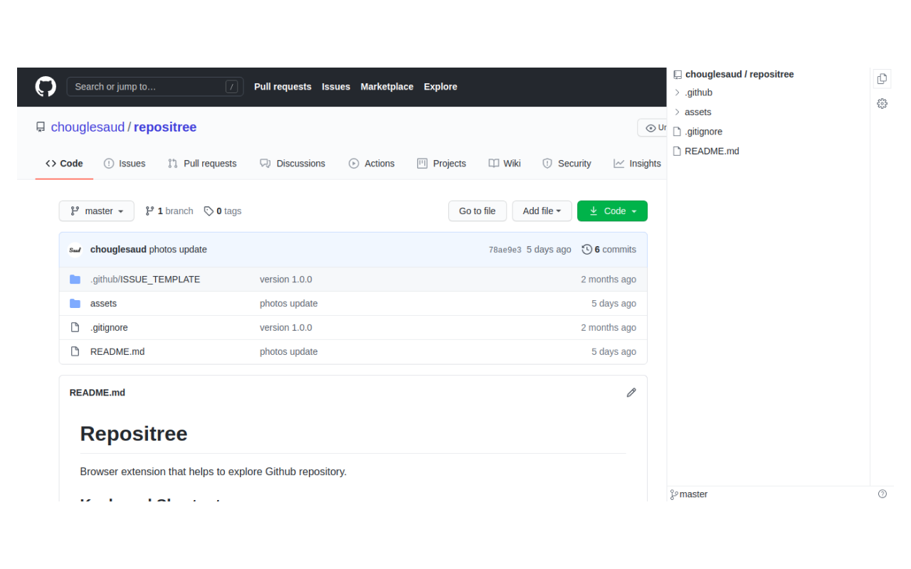
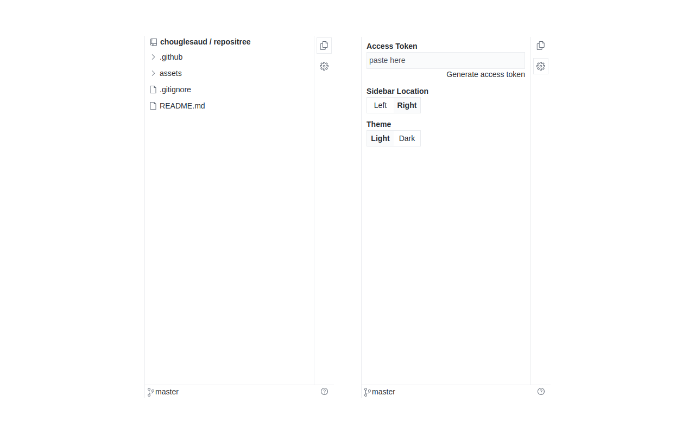
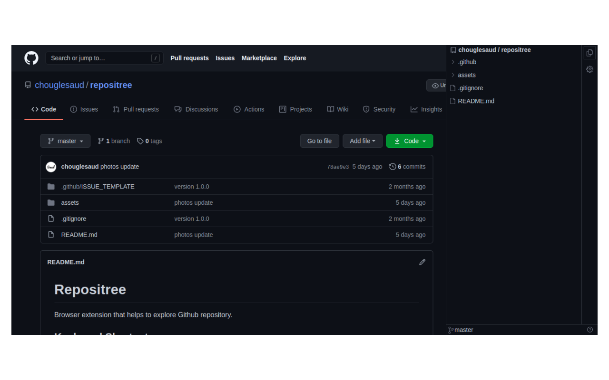
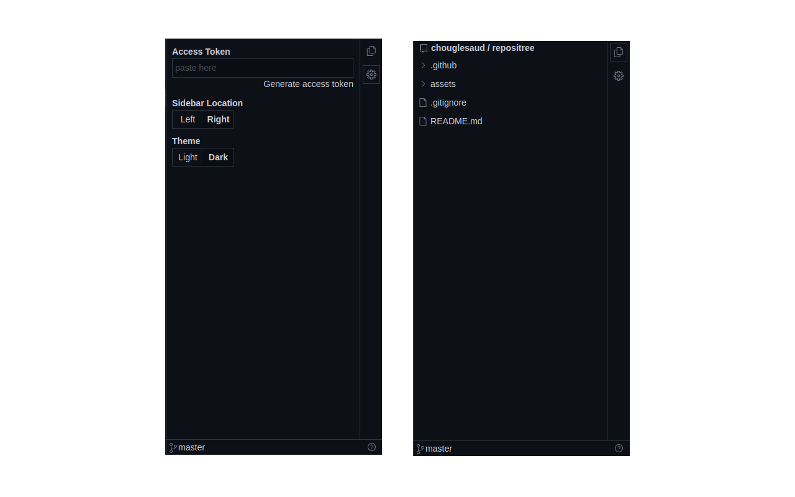

# Repositree

Browser extension that helps to explore Github repository.

## Features

- Clean UI
- IDE-like code tree for GitHub (Public and Private) repositories.
- Left & Right Dock Location.
- Resizable Layout.
- Github Light & Dark themes.
- More Feature Coming Soon...

**have an idea feel free to create feature request**

## Keyboard Shortcut

<kbd>Ctrl + B</kbd> Toggle Side Bar Visibility

## Note

This repository is only for bug report and feature request.

## Browser Support

Firefox coming soon ...
