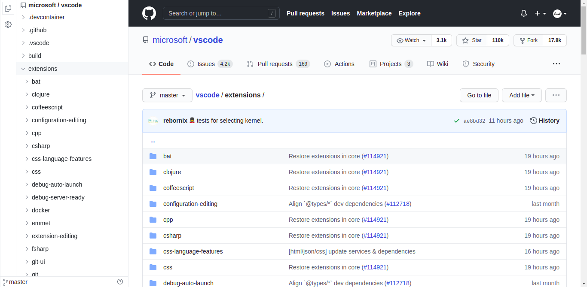
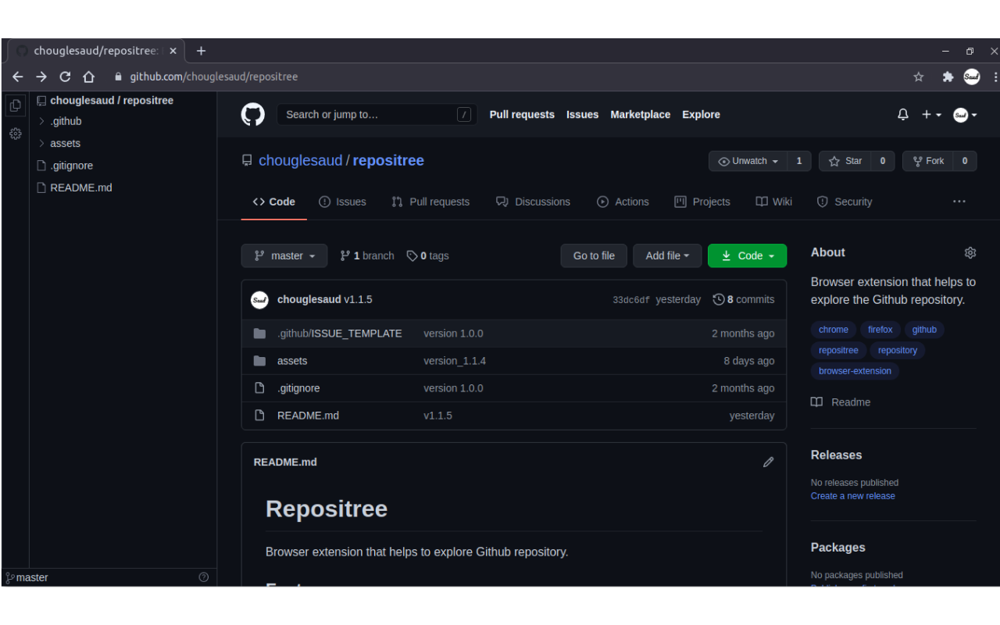

# Repositree

Browser extension that helps to explore Github repository.

## Features

- Clean UI
- IDE-like code tree for GitHub (Public and Private) repositories.
- Left & Right Dock Location.
- Resizable Layout.
- Github Light & Dark themes.
- More Feature Coming Soon...

**have an idea feel free to create feature request**

## Keyboard Shortcut

<kbd>Ctrl + B</kbd> Toggle Side Bar Visibility

## Note

This repository is only for bug report and feature request.

## Browser Support

click on the logo to download

## [Privacy Policy](https://github.com/chouglesaud/repositree/wiki/Privacy-Policy)
1. Repositree doesn't share, collect your data at all.
2. GitHub Access Token or GitHub Personal Access Token is required only when 
you access private repositories or exceed the GitHub API rate limit.
3. Repositree store token in your chrome extension storage, not in the localStorage and use only to authenticate with the GitHub.
