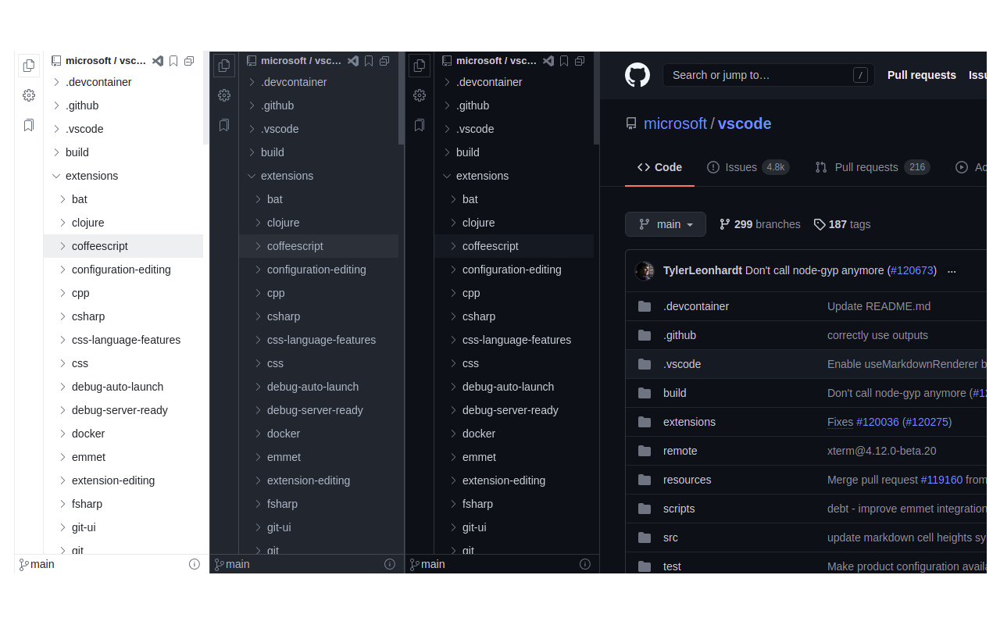
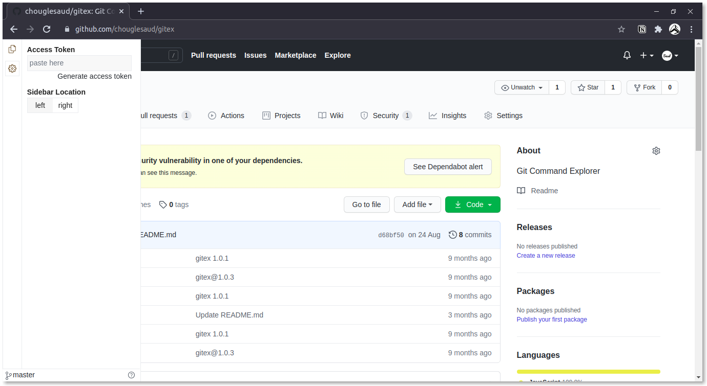

# Repositree

Browser extension that helps to explore Github repository.

## Features

- IDE-like code tree for GitHub (Public and Private) repositories.
- Change the sidebar location to the right or left of the screen.
- Resize sidebar.

**have an idea feel free to create feature request**

## Note

This repository is only for bug report and feature request.

## Browser Support

Firefox comming soon ...
