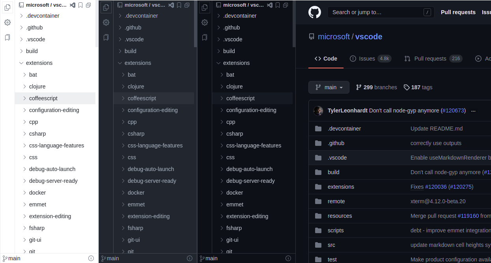

# Repositree

 
 

Browser extension that helps to explore GitHub repository.

## Features

- Clean & Smooth UI
- IDE-like code tree for GitHub (Public and Private) repositories.
- Left & Right Dock Location.
- Resizable Layout.
- GitHub Light,Dark, Dimmed & Dark high contrast themes.
- Bookmark.
- [github1s](https://github.com/conwnet/github1s)(VSCode) Mode.
- More Feature Coming Soon...

## Download
Due to some account management issues Repositree v1.6.1 or higher temperoraly is not available on **Firefox Addons**. We will fix this issues as soon as possible.

| Chrome                                                                                                                         | Firefox                                                                                                |
| ------------------------------------------------------------------------------------------------------------------------------ | ------------------------------------------------------------------------------------------------------ |
|  |  |
| [Download](https://chrome.google.com/webstore/detail/repositree/lafjldoccjnjlcmdhmniholdpjkbgajo)                              | [Download](https://addons.mozilla.org/en-US/firefox/addon/repositree/)                                 |

### Keyboard Shortcut

`Ctrl + B` Toggle Side Bar Visibility

## Changelog

See the whole changelog [here](https://github.com/chouglesaud/repositree/wiki/CHANGELOG)

## Privacy Policy

1. Repositree doesn't share, collect your data at all.
2. GitHub Access Token or GitHub Personal Access Token is required only when
   you access private repositories or exceed the GitHub API rate limit.
3. Repositree store token in your chrome extension storage, not in the localStorage and use only to authenticate with the GitHub.

## Note

This repository is only for bug report and feature request.
